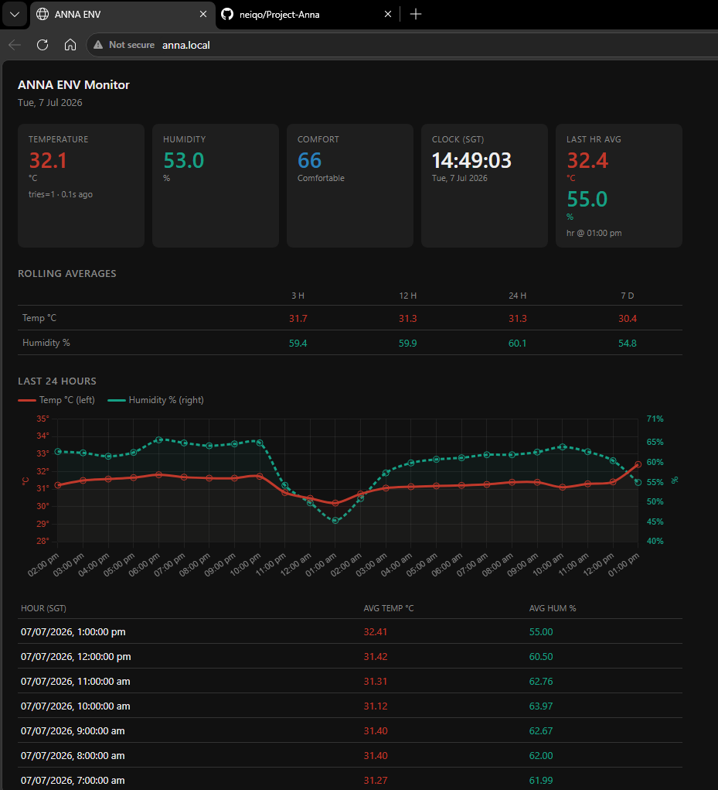
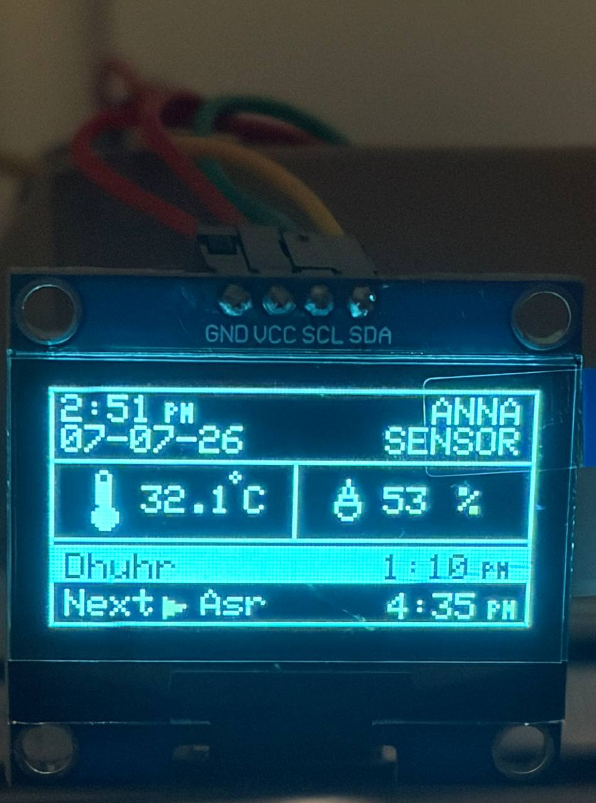

# ANNA
Ambient Nvironmental Notification and Analytics

ANNA is an ESP32-based room monitoring system that tracks indoor temperature and humidity, stores historical measurements, and presents the data through both a web dashboard and a local OLED display. It also tracks daily prayer times and provides audible notifications through a passive buzzer.

The system is designed to provide an at-a-glance view of room conditions and prayer schedule while also allowing long-term trend analysis through automatically generated statistics and charts.

## Features

### Real-Time Monitoring

Using a DHT11 temperature and humidity sensor, the system continuously measures:

* Room temperature (°C)
* Relative humidity (%)
* Comfort index

Current readings are available both on the web dashboard and on the connected OLED display.

### Prayer Time Tracking

ANNA fetches daily prayer timings (Fajr, Dhuhr, Asr, Maghrib, Isha) from the Aladhan API based on a fixed location, refreshing once per day.

* Automatic daily fetch, keyed by date so no redundant API calls
* Determines the current prayer time block and the upcoming prayer in real time
* Displays current and next prayer with times in 12-hour format (with AM/PM)
* Triggers a buzzer chime automatically when the active prayer block changes

### Buzzer Notifications

A passive buzzer (driven via ESP32 LEDC/PWM) provides audible feedback for system events:

* Prayer time block transitions (soft multi-note chime)
* Startup sequence on boot
* Extensible framework for additional melodies (environmental alerts, connection status, etc.)

### Web Dashboard

The ESP32 hosts a lightweight web server that can be accessed from any device on the local network.



The dashboard provides:

* Current temperature and humidity readings
* Comfort indicator
* Live clock (SGT)
* Sensor status information
* Historical environmental data

### Historical Data & Analytics

Measurements are stored locally and processed into rolling averages to help identify trends over time.

Available averages include:

* 3 Hours
* 12 Hours
* 24 Hours
* 7 Days

### Data Visualization

The dashboard includes interactive charts that visualize:

* Temperature trends
* Humidity trends
* Hourly averages
* Multi-day averages

These charts make it easy to identify patterns and changes in room conditions over time.

### OLED Display

A SH1106 OLED display provides local access to the latest sensor readings and prayer schedule without requiring a browser.



Displayed information includes:

* Current time and date (top-left, stacked, 12-hour format)
* Current temperature and humidity (center band)
* Sensor status
* Current prayer block, highlighted (bottom)
* Next prayer with arrow indicator and time (bottom)

## Hardware

### Components

* ESP32 NodeMCU-32S
* DHT11 Temperature & Humidity Sensor
* SH1106 OLED Display (I²C)
* Passive buzzer (PWM-driven via LEDC)
* Breadboard and jumper wires

### OLED Connections

| OLED | ESP32   |
| ---- | ------- |
| VCC  | 3.3V    |
| GND  | GND     |
| SDA  | GPIO 21 |
| SCL  | GPIO 22 |

## Software Overview

The project is organized into several simple modules:

* **Sensor Layer** – Handles DHT11 readings and validation
* **Storage Layer** – Maintains historical data and averages
* **Web Server Layer** – Serves the dashboard and API endpoints
* **Display Layer** – Updates the OLED display with live readings and prayer schedule
* **Prayer Timing Layer** – Fetches and tracks daily prayer times, determines the current/next prayer block
* **Buzzer Layer** – Plays notification melodies for system and prayer events

## Dashboard

The web dashboard provides a centralized view of environmental conditions, including:

* Current temperature
* Current humidity
* Comfort score
* Clock and date
* Rolling averages
* 24-hour trend charts
* 7-day trend charts

All values update automatically without requiring a page refresh.

## Network Features

The device supports:

* Wi-Fi connectivity
* mDNS hostname resolution
* NTP time synchronization

The dashboard can be accessed using:

```text
http://anna.local
```

or directly through the ESP32's IP address.

## Planned Enhancements

### Outdoor Weather Comparison

Future versions will integrate online weather data to provide additional context for indoor measurements.

Planned functionality includes:

* Outdoor temperature display
* Outdoor humidity display
* Indoor vs. outdoor comparisons
* Environmental insights and recommendations

### Additional Buzzer Events

* Environmental alerts (e.g. temperature/humidity thresholds)
* Connection status feedback (Wi-Fi loss/reconnect)

## Current Status

### Implemented

* ESP32-based web server
* DHT11 temperature and humidity monitoring
* Historical data storage
* Rolling average calculations
* Interactive dashboard charts
* SH1106 OLED display integration
* Wi-Fi connectivity
* mDNS support
* NTP time synchronization
* Prayer time fetching and daily refresh (Aladhan API)
* Current/next prayer block detection
* OLED prayer schedule display (12-hour format, highlighted current block)
* Passive buzzer notifications (startup + prayer time transitions)

### In Development

* Outdoor weather integration
* Additional buzzer event types (environmental/connection alerts)
* Additional dashboard improvements

## Project Goal

The goal of ANNA is to create a lightweight and extensible room monitoring platform that provides immediate environmental feedback, prayer schedule awareness, and long-term insights through historical data analysis, while remaining simple enough to run entirely on an ESP32.